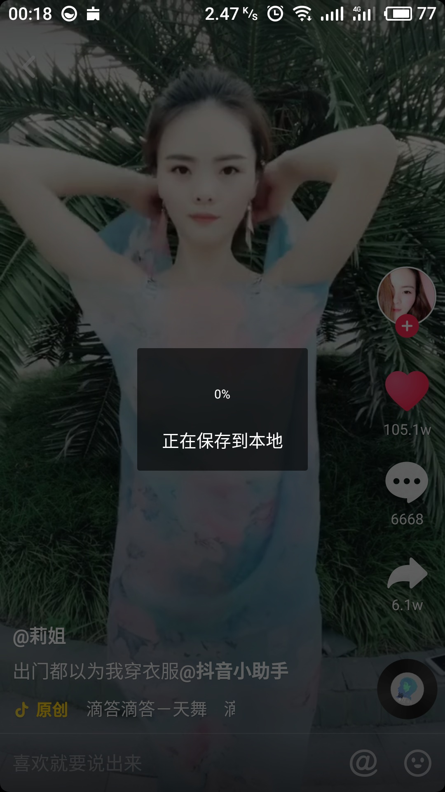
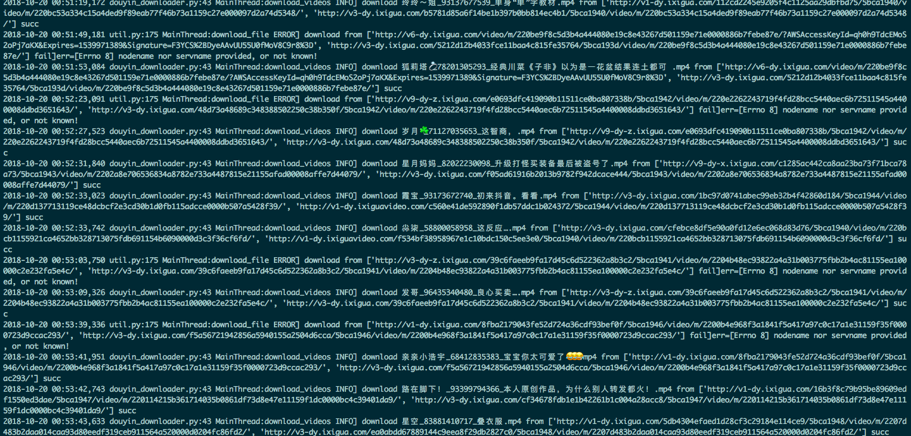
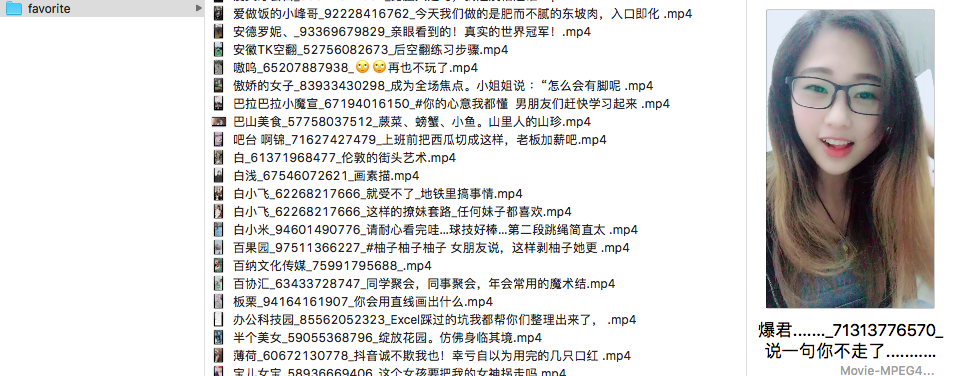

# douyin_downloader

```univers.flf
                                 88                                     88
                                 88                                     ""
                                 88
                         ,adPPYb,88  ,adPPYba,  88       88 8b       d8 88 8b,dPPYba,
                        a8"    `Y88 a8"     "8a 88       88 `8b     d8' 88 88P'   `"8a
                        8b       88 8b       d8 88       88  `8b   d8'  88 88       88
                        "8a,   ,d88 "8a,   ,a8" "8a,   ,a88   `8b,d8'   88 88       88
                         `"8bbdP"Y8  `"YbbdP"'   `"YbbdP'Y8     Y88'    88 88       88
                                                                d8'
                                                               d8'
         88                                            88                                 88
         88                                            88                                 88
         88                                            88                                 88
 ,adPPYb,88  ,adPPYba,  8b      db      d8 8b,dPPYba,  88  ,adPPYba,  ,adPPYYba,  ,adPPYb,88  ,adPPYba, 8b,dPPYba,
a8"    `Y88 a8"     "8a `8b    d88b    d8' 88P'   `"8a 88 a8"     "8a ""     `Y8 a8"    `Y88 a8P_____88 88P'   "Y8
8b       88 8b       d8  `8b  d8'`8b  d8'  88       88 88 8b       d8 ,adPPPPP88 8b       88 8PP""""""" 88
"8a,   ,d88 "8a,   ,a8"   `8bd8'  `8bd8'   88       88 88 "8a,   ,a8" 88,    ,88 "8a,   ,d88 "8b,   ,aa 88
 `"8bbdP"Y8  `"YbbdP"'      YP      YP     88       88 88  `"YbbdP"'  `"8bbdP"Y8  `"8bbdP"Y8  `"Ybbd8"' 88
```

如果你也是曾经沉迷过抖音，那我相信你的抖音里面点赞的视频数量一定不比我的少。但是最近我遇到了一个烦恼，很多以前点赞的视频都被作者删掉了，感觉很可惜...为了避免再发生这类事情，我决定先把已经喜欢的视频下载下来！然而事情并没有我想的那么简单，我发现在手机上下载简直是龟速！WTF???

 

所以不得不充分发挥我的聪明才智--上网搜一下有没有现成的抖音下载器！于是找到了 https://github.com/AppSign/douyin 和 https://github.com/hacksman/spider_world . 在我尝试着用现有轮子来下载我的喜欢列表的过程中，我发现在我的渣渣网速下，等半天没下载成功还抛出了异常，然后重新下载....形成了一个死循环。鉴于大神们已经将最艰难的数据抓包分析给出了下载相关demo，所以我干脆就自己写一个更顺手的爬虫了，撸起袖子就搞出来了这个工具～至少在我的渣渣网速下，可以顺利达成我的目标了。为了造福和我一样的 douyiner ，稍加整理了一下代码，欢迎大家尝试，如果使用过程中遇到了什么不顺手的，欢迎提出您宝贵的建议。

项目地址： [https://github.com/HeLiangHIT/douyin_downloader](https://github.com/HeLiangHIT/douyin_downloader)


# 使用方法

安装后使用：
1. 安装： `git clone https://github.com/HeLiangHIT/douyin_downloader.git && cd douyin_downloader && python setup.py install` 或者 `pip install douyin_downloader`
2. 使用： 执行 `douyin_downloader` 命令，然后根据提示输入合适参数。

```
Input user_id:123
Choose action[1.favorite, 2.post] *default 1:
Do you want to follow user? [yes/no] *default no:
Input video save dir *default /Users/heliang/Movies/douyin/:
begin to download 123's favorite video to /Users/heliang/Movies/douyin/ ...
...
```


从源码运行：
查看帮助： `python douyin_downloader.py --help`

```
抖音下载器: 异步下载抖音视频。 follow 参数用于指定是否是下载关注的用户视频。

Usage:
  douyin_downloader.py [--dir=dir] [--concurrency=concurrency] [--follow=follow] <user> <action> follow
  douyin_downloader.py [--dir=dir] [--concurrency=concurrency] [--follow=follow] <user> <action>
  douyin_downloader.py --version

Options:
  --dir=dir                    select file save dir. * default: '$HOME/Movies/douyin/'
  --concurrency=concurrency    select the concurrency number of downloader. [default: 20]
```
> 关于用户 user_id 的获取， 参考 https://github.com/hacksman/spider_world 的介绍。


举例：

1. `python douyin_downloader.py 84834596404 favorite` 下载用户 84834596404 喜欢过的视频。
2. `python douyin_downloader.py --dir=. --concurrency=10 84834596404 post` 下载用户 84834596404 上传的视频。
3. `python douyin_downloader.py 84838778760 favorite follow` 下载用户 84838778760 关注的用户喜欢过的视频。
4. `python douyin_downloader.py 84838778760 post follow` 下载用户 84838778760 关注的用户上传的视频。


下载过程和结果展示：





# TODO

* [ ] 从首页依次爬取抖音所有点击量超过1w的视频下载...
* [ ] 顺藤摸瓜，爬取自己关注的人->爬取他们关注的人...把整个抖音数据库都扒下来了，看看有没有用...
* [ ] 融入美女自动识别等功能（可以参考 [Douyin-Bot](https://github.com/wangshub/Douyin-Bot) ）。


# 参考

1. https://github.com/AppSign/douyin
2. https://github.com/hacksman/spider_world
3. https://github.com/python-trio/trio
4. https://github.com/theelous3/asks


欢迎扫码关注作者，获取更多信息哦～另外如果本源码对你有所帮助，可以[点赞以支持作者的持续更新](./img/URgood.jpg)。


